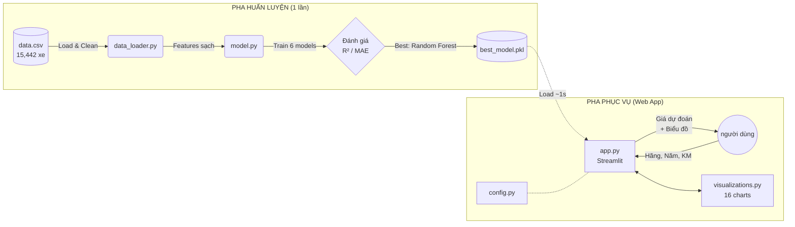
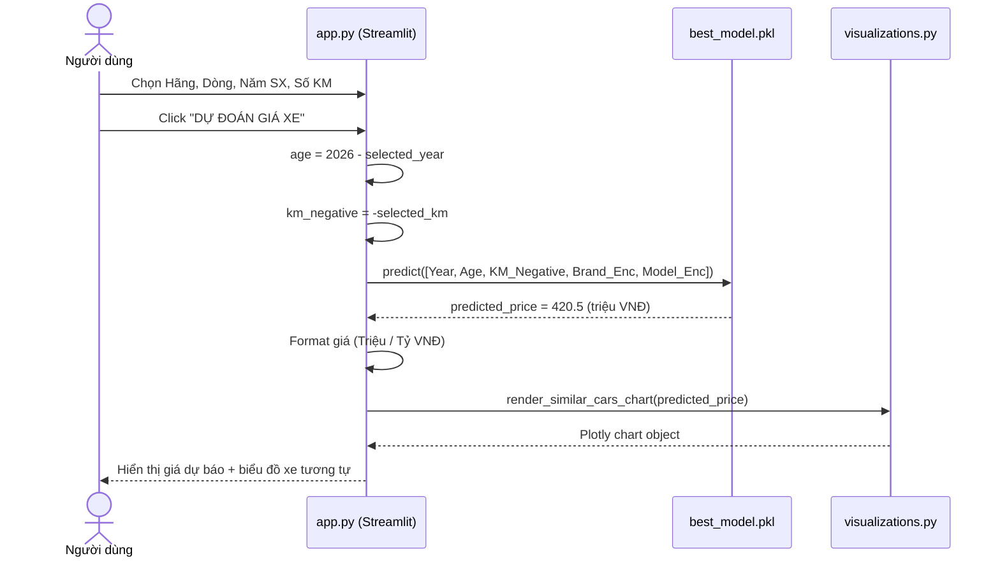
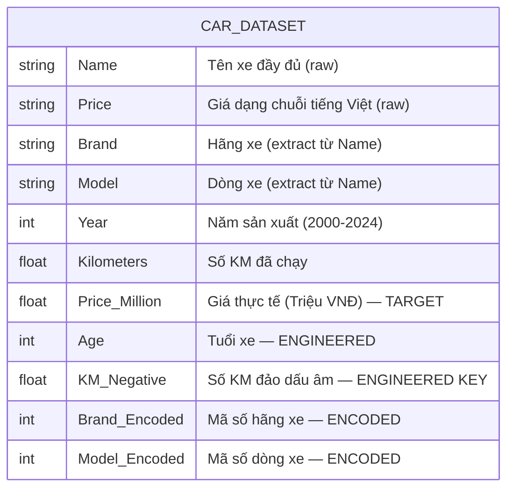

# BÁO CÁO PHÂN TÍCH & THIẾT KẾ HỆ THỐNG
# DỰ ÁN: HỆ THỐNG DỰ BÁO GIÁ XE Ô TÔ CŨ TẠI VIỆT NAM
# SỬ DỤNG MACHINE LEARNING

---

> **Ngày thực hiện:** 2026-03-20  
> **Phiên bản hệ thống:** Random Forest v2.0 (với KM_Negative fix)  
> **Ngôn ngữ lập trình:** Python 3.14.2  
> **Trạng thái:** ✅ Hoàn chỉnh & Hoạt động

---

## MỤC LỤC

1. [Tổng Quan Dự Án](#1-tổng-quan-dự-án)
2. [Phân Tích Hiện Trạng & Lý Do Chọn Đề Tài](#2-phân-tích-hiện-trạng--lý-do-chọn-đề-tài)
3. [Sơ Đồ Hệ Thống (System Architecture Diagram)](#3-sơ-đồ-hệ-thống)
4. [Sơ Đồ Mức Ngữ Cảnh (Context Diagram - DFD Level 0)](#4-sơ-đồ-mức-ngữ-cảnh)
5. [Sơ Đồ Phân Cấp Chức Năng (Functional Decomposition)](#5-sơ-đồ-phân-cấp-chức-năng)
6. [Sơ Đồ Tuần Tự / Liên Kết (Sequence Diagram)](#6-sơ-đồ-tuần-tự--liên-kết)
7. [Sơ Đồ Quan Hệ Tập Dữ Liệu (Dataset Schema / ERD)](#7-sơ-đồ-quan-hệ-tập-dữ-liệu)
8. [Phân Tích Dữ Liệu & Tiền Xử Lý](#8-phân-tích-dữ-liệu--tiền-xử-lý)
9. [Kỹ Nghệ Đặc Trưng (Feature Engineering)](#9-kỹ-nghệ-đặc-trưng-feature-engineering)
10. [Huấn Luyện & Lựa Chọn Mô Hình Machine Learning](#10-huấn-luyện--lựa-chọn-mô-hình-machine-learning)
11. [Yếu Tố Then Chốt Chọn Random Forest](#11-yếu-tố-then-chốt-chọn-random-forest)
12. [Đánh Giá Hiệu Suất Mô Hình](#12-đánh-giá-hiệu-suất-mô-hình)
13. [Thiết Kế Giao Diện Ứng Dụng Web](#13-thiết-kế-giao-diện-ứng-dụng-web)
14. [Cấu Trúc File & Chức Năng Từng Module](#14-cấu-trúc-file--chức-năng-từng-module)
15. [Kết Luận & Hướng Phát Triển](#15-kết-luận--hướng-phát-triển)

---

## 1. TỔNG QUAN DỰ ÁN

### 1.1 Mô Tả Dự Án

Dự án **Hệ Thống Dự Báo Giá Xe Ô Tô Cũ tại Việt Nam** là một ứng dụng Machine Learning hoàn chỉnh, cho phép người dùng nhập vào các thông số cơ bản của một chiếc xe (Hãng xe, Dòng xe, Năm sản xuất, Số Km đã đi) và nhận được kết quả dự báo giá bán sát với giá trị thực tế trên thị trường.

Hệ thống được xây dựng theo quy trình phát triển phần mềm AI chuẩn công nghiệp, từ bước nghiên cứu thuật toán (Research Phase) trên Jupyter Notebook cho đến giai đoạn triển khai thành sản phẩm Web (Production Phase) sử dụng framework Streamlit.

### 1.2 Mục Tiêu Dự Án

| Mục Tiêu | Chi Tiết |
|----------|----------|
| **Kỹ thuật** | Xây dựng mô hình AI có R² ≥ 80% (giải thích ≥ 80% sự thay đổi giá xe) |
| **Ứng dụng** | Triển khai thành ứng dụng web có thể sử dụng thực tế |
| **Phân tích** | Khám phá ra các yếu tố then chốt ảnh hưởng đến giá xe ô tô cũ tại VN |
| **Học thuật** | Thực hành và nắm vững quy trình chuẩn của một dự án Machine Learning |

### 1.3 Phạm Vi Dự Án

- **Trong phạm vi:** Dự báo giá xe ô tô cũ dựa trên 5 thông số (Hãng, Dòng, Năm, Số KM, Tuổi xe)
- **Ngoài phạm vi:** Không xét đến tình trạng đâm đụng, màu sắc, lịch sử bảo dưỡng, vị trí địa lý

### 1.4 Công Nghệ Sử Dụng

| Thư Viện | Phiên Bản | Chức Năng |
|----------|-----------|-----------|
| **Python** | 3.14.2 | Ngôn ngữ lập trình chính |
| **scikit-learn** | 1.8.0 | Framework Machine Learning |
| **Streamlit** | 1.53.1 | Xây dựng giao diện Web App |
| **Pandas** | 2.3.3 | Xử lý dữ liệu dạng bảng (DataFrame) |
| **NumPy** | 2.4.2 | Tính toán số học, xử lý mảng |
| **Plotly** | 6.5.2 | Vẽ biểu đồ tương tác (Interactive Charts) |

### 1.5 Thông Tin Bộ Dữ Liệu

| Thuộc Tính | Giá Trị |
|------------|---------|
| **Nguồn** | Kaggle — Vietnam Car Prices |
| **Số bản ghi gốc** | 15,442 lượt rao bán |
| **Sau khi làm sạch** | 8,685 xe hợp lệ |
| **Khoảng giá** | 29 Triệu — 2,130 Triệu VNĐ |
| **Số hãng xe** | 15+ hãng (Toyota, Mercedes, Hyundai, Kia, Ford...) |
| **Số dòng xe** | 100+ dòng (Vios, Civic, CX-5, Ranger...) |
| **Khoảng năm SX** | 2000 — 2024 |

---

## 2. PHÂN TÍCH HIỆN TRẠNG & LÝ DO CHỌN ĐỀ TÀI

### 2.1 Bài Toán Thực Tế

Thị trường xe ô tô cũ tại Việt Nam hiện đang thiếu một công cụ định giá khách quan và minh bạch. Người mua thường phụ thuộc hoàn toàn vào thông tin từ người bán hoặc kinh nghiệm chủ quan, dẫn đến nhiều trường hợp mua xe với giá quá cao hoặc bán xe với giá quá thấp do không nắm được mặt bằng giá chính xác của thị trường.

### 2.2 Giải Pháp Đề Xuất

Xây dựng hệ thống AI học từ **8,685 giao dịch thực tế** đã được ghi nhận trên thị trường để tổng hợp ra các quy luật định giá ngầm ẩn. Thay vì "đoán mò", hệ thống đưa ra mức giá tham chiếu dựa trên thống kê khoa học từ dữ liệu thực tế.

### 2.3 Phân Loại Bài Toán Machine Learning

Đây là bài toán **Học có giám sát (Supervised Learning)** với loại hình **Hồi quy (Regression)**:

| Yếu Tố | Giá Trị |
|--------|---------|
| **Phương pháp** | Supervised Learning (Học có giám sát — dữ liệu có nhãn sẵn) |
| **Loại bài toán** | Regression (dự đoán số liên tục, không phải phân loại) |
| **Input (X)** | Year, Age, KM_Negative, Brand_Encoded, Model_Encoded |
| **Output (y)** | Price_Million (Giá xe — đơn vị Triệu VNĐ) |

---

## 3. SƠ ĐỒ HỆ THỐNG

Kiến trúc hệ thống chia làm 2 pha độc lập: **Pha Huấn Luyện (Offline)** và **Pha Phục Vụ (Online)**.

```
╔══════════════════════════════════════════════════════════════════╗
║              PHA HUẤN LUYỆN (OFFLINE - chạy 1 lần)              ║
║                                                                  ║
║   [data.csv]                                                     ║
║      │                                                           ║
║      ▼                                                           ║
║   [data_loader.py]  ──── Làm sạch dữ liệu                       ║
║      │              ──── Xử lý lỗi Font tiếng Việt               ║
║      │              ──── Feature Engineering (Age, KM_Negative)  ║
║      │              ──── Label Encoding (Brand/Model → số)       ║
║      │                                                           ║
║      ▼                                                           ║
║   [model.py]  ──── Train 6 thuật toán song song                  ║
║      │        ──── Đánh giá R², MAE, RMSE từng model             ║
║      │        ──── Auto-select model tốt nhất (Random Forest)    ║
║      │                                                           ║
║      ▼                                                           ║
║   [train_model.py]  ──── Serialize → [best_model.pkl]            ║
╚══════════════════════════════════════════════════════════════════╝
                              │
                              │ best_model.pkl (57 MB)
                              │
╔══════════════════════════════════════════════════════════════════╗
║              PHA PHỤC VỤ (ONLINE WEB APP - chạy thường xuyên)   ║
║                                                                  ║
║   [app.py]  ──── Load best_model.pkl (~1 giây)                   ║
║      │      ──── Render giao diện 5 tabs                         ║
║      │      ──── Nhận input từ người dùng                        ║
║      │      ──── Gọi model.predict() → Trả ra giá tiền           ║
║      │                                                           ║
║   [visualizations.py]  ──── Vẽ 16 biểu đồ Plotly tương tác      ║
║   [config.py]          ──── Hằng số, màu sắc, danh sách xe       ║
╚══════════════════════════════════════════════════════════════════╝
```

**Sơ đồ dạng Mermaid (dán vào Mermaid Live để xem):**



---

## 4. SƠ ĐỒ MỨC NGỮ CẢNH (Context Diagram - DFD Level 0)

Sơ đồ này mô tả hệ thống ở mức cao nhất, thể hiện mối quan hệ với các tác nhân bên ngoài.

```
                    ┌─────────────────────────────────┐
                    │                                 │
  [Người dùng]──────► Thông tin xe (Hãng, Dòng,       │
                    │  Năm SX, Số KM đã đi)            │
                    │                                 │
                    │    HỆ THỐNG DỰ BÁO             │
                    │      GIÁ XE Ô TÔ               │─────► Giá xe dự báo
                    │                                 │      Biểu đồ phân tích
                    │                                 │ ◄── [Người dùng]
                    └────────────────┬────────────────┘
                                     │
                                     ▲
                    [Dataset Kaggle] │ Dữ liệu thô 15,442 xe
                    (data/data.csv)  │
```

**Các tác nhân (Actors):**

| Tác Nhân | Vai Trò | Luồng Dữ Liệu |
|----------|---------|----------------|
| **Người dùng cuối** | Tra cứu giá xe | Input: Thông số xe → Output: Giá dự báo + Phân tích |
| **Dataset Kaggle** | Nguồn dữ liệu huấn luyện | Cung cấp 15,442 bản ghi xe thực tế |

---

## 5. SƠ ĐỒ PHÂN CẤP CHỨC NĂNG

```
                     ┌───────────────────────────────────┐
                     │    HỆ THỐNG DỰ BÁO GIÁ XE Ô TÔ   │
                     └──────────────┬────────────────────┘
              ┌───────────┬─────────┴─────────┬───────────────┐
              ▼           ▼                   ▼               ▼
     ┌──────────────┐ ┌──────────┐   ┌──────────────────┐ ┌──────────────┐
     │  1. Tiền Xử  │ │ 2. Huấn  │   │  3. Dự Báo Giá   │ │  4. Phân     │
     │  Lý Dữ Liệu  │ │ Luyện AI │   │  (Prediction)    │ │  Tích & Báo  │
     └──────┬───────┘ └────┬─────┘   └────────┬─────────┘ │  Cáo         │
            │              │                   │            └──────┬───────┘
      ┌─────┼─────┐   ┌────┼────┐        ┌────┴────┐             │
      ▼     ▼     ▼   ▼    ▼    ▼        ▼         ▼       ┌─────┼─────┐
  Load  Clean  Feat Train Eval Select  Nhập   Tính &       ▼     ▼     ▼
  CSV   Data   Eng  6     Model Best   Form   Predict   Biểu  Hiệu  Dữ
                    Algo        Model  xe     Price     Đồ    Suất  Liệu
```

**Chi tiết từng chức năng:**

| Chức Năng | Module | Chi Tiết |
|-----------|--------|----------|
| **1.1 Load CSV** | `data_loader.py` | Đọc file, thử 3 encoding (utf-8, utf-8-sig, latin-1) |
| **1.2 Clean Data** | `data_loader.py` | Xóa outliers bằng IQR×3, xóa trùng lặp |
| **1.3 Feature Engineering** | `data_loader.py` | Tính Age, tạo KM_Negative, Label Encoding |
| **2.1 Train 6 Models** | `model.py` | Linear, Ridge, Lasso, SVR, RF, Gradient Boosting |
| **2.2 Evaluate** | `model.py` | Tính R², MAE, RMSE trên tập Test |
| **2.3 Select Best** | `model.py` | Auto-select model có R² Test cao nhất |
| **3.1 Nhập Form xe** | `app.py` | Sidebar UI chọn Hãng, Dòng, Năm, KM |
| **3.2 Predict Price** | `app.py` + `model.py` | Gọi model.predict() trả ra giá tiền |
| **4.1 Biểu Đồ** | `visualizations.py` | 16 interactive Plotly charts |
| **4.2 Hiệu Suất** | `app.py` Tab 3 | So sánh 6 models, residual plot |
| **4.3 Dữ Liệu** | `app.py` Tab 4 | Dataset explorer, download CSV |

---

## 6. SƠ ĐỒ TUẦN TỰ / LIÊN KẾT (Sequence Diagram)

### 6.1 Luồng Chính: Người Dùng Dự Báo Giá Xe

```
Người Dùng       Giao Diện (app.py)      AI Model (best_model.pkl)     Biểu Đồ (viz.py)
     │                    │                          │                        │
     │── Chọn Hãng,Dòng ─►│                          │                        │
     │── Chọn Năm, KM ───►│                          │                        │
     │── Ấn "DỰ ĐOÁN" ───►│                          │                        │
     │                    │── Validate input ────────│                        │
     │                    │── age = 2026 - Year       │                        │
     │                    │── km_neg = -selected_km   │                        │
     │                    │── Tạo mảng features ─────►│                        │
     │                    │                          │── predict(X_new) ──────►│
     │                    │                          │◄─ return 420.5 (triệu) ─│
     │                    │◄─ predicted_price ────────│                        │
     │                    │── Format "420 Triệu VNĐ" ─┤                        │
     │                    │── Render biểu đồ ─────────┼───────────────────────►│
     │◄── Hiển thị kết quả┤                           │                        │
     │    + Xe tương tự   │                           │                        │
```

**Mermaid Sequence Diagram:**



---

## 7. SƠ ĐỒ QUAN HỆ TẬP DỮ LIỆU (Dataset Schema)

> **Lưu ý:** Dự án sử dụng file CSV (không dùng Database SQL), vì vậy sơ đồ này mô tả cấu trúc **Schema của tập dữ liệu** thay vì ERD truyền thống.

```
┌──────────────────────────────────────────────────────────┐
│                    CAR_DATASET (data.csv)                 │
├──────────────────────────────────────────────────────────┤
│  CỘT GỐC (từ Kaggle):                                    │
│  ┌──────────────┬─────────────────────────────────────┐  │
│  │ Name         │ "Toyota Vios 1.5E CVT 2020"         │  │
│  │ Price        │ "450 Triệu" (string tiếng Việt)     │  │
│  │ Năm SX       │ "2020"                               │  │
│  │ Số KM        │ "38,000 Km"                          │  │
│  │ Nhiên liệu   │ "Xăng"                               │  │
│  │ Hộp số       │ "Tự động"                            │  │
│  └──────────────┴─────────────────────────────────────┘  │
│                                                          │
│  CỘT SAU TIỀN XỬ LÝ (data_loader.py):                   │
│  ┌──────────────┬─────────────────────────────────────┐  │
│  │ Brand        │ "Toyota"      (extract từ Name)      │  │
│  │ Model        │ "Vios"        (extract từ Name)      │  │
│  │ Year         │ 2020          (numeric)              │  │
│  │ Kilometers   │ 38000         (numeric, đã parse)    │  │
│  │ Price_Million│ 450.0         (numeric triệu VNĐ)    │  │
│  └──────────────┴─────────────────────────────────────┘  │
│                                                          │
│  CỘT FEATURE ENGINEERING (data_loader.py):               │
│  ┌──────────────┬─────────────────────────────────────┐  │
│  │ Age          │ 6    (= 2026 - 2020)                 │  │
│  │ KM_Negative  │ -38000  (= -Kilometers) ⭐ KEY       │  │
│  │ Brand_Encoded│ 45   (Toyota → số ID)               │  │
│  │ Model_Encoded│ 123  (Vios → số ID)                  │  │
│  └──────────────┴─────────────────────────────────────┘  │
│                                                          │
│  FEATURES ĐƯA VÀO MODEL (5 cột cuối cùng):              │
│  X = [Year, Age, KM_Negative, Brand_Encoded,             │
│        Model_Encoded]                                    │
│  y = [Price_Million]                                     │
└──────────────────────────────────────────────────────────┘
```

**Mermaid ERD:**


---

## 8. PHÂN TÍCH DỮ LIỆU & TIỀN XỬ LÝ

### 8.1 Pipeline Xử Lý Dữ Liệu (9 Bước Tuần Tự)

Toàn bộ quy trình xử lý nằm trong file `data_loader.py`, hàm `get_full_pipeline()`:

```
Bước 1: load_data()               → Đọc CSV (thử 3 encoding: utf-8, utf-8-sig, latin-1)
           ↓
Bước 2: clean_column_names()      → Đổi tên cột tiếng Việt → tiếng Anh (có xử lý garbled encoding)
           ↓
Bước 3: extract_brand_model()     → "Toyota Vios 2020" → Brand="Toyota", Model="Vios"
           ↓
Bước 4: clean_price()             → "1 Tỷ 118 Triệu" → 1118.0 (triệu VNĐ)
           ↓
Bước 5: clean_numeric_features()  → "38,000 Km" → 38000 (số); lọc năm 2000-2024
           ↓
Bước 6: engineer_features()       → Tạo Age, KM_Negative vào DataFrame
           ↓
Bước 7: clean_data()              → IQR×3 lọc outliers, xóa trùng, xóa thiếu
           ↓
Bước 8: encode_categorical()      → Label Encoding: Brand, Model → số nguyên
           ↓
Bước 9: prepare_features()        → Chọn 5 features cuối → trả về X, y
```

### 8.2 Kết Quả Sau Làm Sạch

| Giai Đoạn | Số Bản Ghi | Ghi Chú |
|-----------|------------|---------|
| Dữ liệu gốc | 15,442 | Lấy từ Kaggle |
| Sau lọc KM hợp lệ | ~11,000 | Loại xe không có dữ liệu KM |
| Sau loại outliers (IQR) | 8,685 | Loại xe có giá bất thường |
| **Final dataset** | **8,685** | **Sẵn sàng train** |

### 8.3 Xử Lý 3 Loại Lỗi Font Tiếng Việt

Đây là điểm kỹ thuật đặc biệt của dự án khi làm việc với dữ liệu tiếng Việt trên Windows:

**Lỗi 1: File CSV bị lỗi encoding khi đọc**
```python
# data_loader.py - hàm load_data() - dòng 57-64
for encoding in ['utf-8', 'utf-8-sig', 'latin-1']:
    try:
        self.df = pd.read_csv(self.csv_path, encoding=encoding)
        break
    except UnicodeDecodeError:
        continue
```

**Lỗi 2: Tên cột bị biến dạng (Garbled Column Names)**
```python
# data_loader.py - hàm clean_column_names() - dòng 112-132
# Ví dụ tên cột bị lỗi: 'NÄ\x83m sản xuất:' thay vì 'Năm sản xuất:'
garbled_mapping = {
    'NÄ\x83m sản xuất:':  'Year',
    'Sá»\x91 Km Ä\x91ã Ä\x91i:': 'Kilometers',
    # ... 10+ trường hợp khác
}
full_mapping = {**column_mapping, **garbled_mapping}
self.df = self.df.rename(columns=full_mapping)
```

**Lỗi 3: Giá tiền bị lỗi font trong giá trị dữ liệu**
```python
# data_loader.py - hàm clean_price() - dòng 198-212
# Xử lý cả dạng đúng "Tỷ" và dạng lỗi "Tá»·"
if any(x in price_str for x in ['Tỷ', 'tỷ', 'Tá»·', 'tá»·']):
    ty_match = re.search(r'(\d+(?:\.\d+)?)\s*(?:[Tt]ỷ|[Tt]á»·)', price_str)
# Kết quả: "1 Tỷ 118 Triệu" → 1118 (triệu VNĐ)
```

---

## 9. KỸ NGHỆ ĐẶC TRƯNG (Feature Engineering)

### 9.1 Tổng Hợp 5 Features Cuối Cùng

| Feature | Nguồn gốc | Code | Tầm Quan Trọng |
|---------|-----------|------|----------------|
| `Year` | Dữ liệu gốc | `df['Year']` | 9.64% |
| `Age` | **Engineered** | `2026 - df['Year']` | 10.84% |
| `KM_Negative` | **Engineered** ⭐ | `-df['Kilometers']` | 10.46% |
| `Brand_Encoded` | Encoded | `LabelEncoder(Brand)` | 24.26% |
| `Model_Encoded` | Encoded | `LabelEncoder(Model)` | 44.79% |

### 9.2 Kỹ Thuật Đảo Dấu KM (KM_Negative) — Điểm Sáng Tạo

**Vấn đề ban đầu:**
```
Số KM dương (30,000) → Feature value tăng → Model tưởng giá tăng ❌
Số KM dương (200,000) → Feature value rất cao → Model tưởng giá cũng rất cao ❌
```

**Giải pháp sáng tạo:**
```python
# data_loader.py - engineer_features() - dòng 315
# KM âm để có tương quan ĐÚNG với giá xe
self.df['KM_Negative'] = -self.df['Kilometers']
```

**Kết quả sau fix:**
```
KM_Negative = -30,000  (xe ít đi)   → Giá trị lớn hơn → Giá cao ✅
KM_Negative = -200,000 (xe nhiều đi) → Giá trị nhỏ hơn → Giá thấp ✅
```

### 9.3 Label Encoding

```python
# data_loader.py - encode_categorical_features() - dòng 388-392
le = LabelEncoder()
col_data = self.df[[col]].iloc[:, 0].astype(str)
self.df[f'{col}_Encoded'] = le.fit_transform(col_data)

# Kết quả:
# "Toyota" → Brand_Encoded = 45
# "Honda"  → Brand_Encoded = 20
# "Vios"   → Model_Encoded = 123
```

---

## 10. HUẤN LUYỆN & LỰA CHỌN MÔ HÌNH MACHINE LEARNING

### 10.1 Chia Tập Dữ Liệu Train/Test

```python
# model.py - hàm train() - dòng 102-104
X_train, X_test, y_train, y_test = train_test_split(
    X, y, test_size=0.2, random_state=42
)
# Training set: 6,948 xe (80%)
# Test set:     1,737 xe (20%)
```

> **Nguyên tắc vàng:** Không bao giờ dùng Test Set để train. Model chỉ được thấy tập Test khi chấm điểm cuối cùng.

### 10.2 Vòng Lặp Train 6 Thuật Toán

```python
# model.py - dòng 130-175
for model_key in model_types:
    model.fit(X_train, y_train)          # BƯỚC 1: Học từ dữ liệu
    y_pred_test = model.predict(X_test)  # BƯỚC 2: Dự đoán
    r2_test = r2_score(y_test, y_pred_test)  # BƯỚC 3: Chấm điểm
    if r2_test > self.best_score:
        self.best_model = model          # BƯỚC 4: Cập nhật best
```

### 10.3 Kết Quả So Sánh 6 Thuật Toán

| Thuật Toán | R² Train | R² Test | MAE | RMSE | Nhận Xét |
|------------|----------|---------|-----|------|-----------|
| **Random Forest** ⭐ | **96.26%** | **86.18%** | **87M** | **160M** | 🏆 Tốt nhất |
| Gradient Boosting | 74.69% | 73.72% | 149M | 221M | Tốt, ít overfit |
| Ridge Regression | ~19% | 19.67% | 288M | 386M | Underfit — quá đơn giản |
| Linear Regression | ~19% | 19.67% | 288M | 386M | Underfit — quá đơn giản |
| Lasso Regression | ~19% | 19.65% | 288M | 386M | Underfit — quá đơn giản |
| SVR (RBF Kernel) | N/A | 5.18% | 291M | N/A | Fail — cần StandardScaler |

---

## 11. YẾU TỐ THEN CHỐT CHỌN RANDOM FOREST

### Yếu Tố 1: Xử Lý Phi Tuyến Tính (Non-linear Relationships)

Giá xe không rớt theo đường thẳng. Một chiếc Mercedes 2015 và Toyota 2015 cùng năm nhưng giá khác nhau 3-4 lần. Random Forest xây dựng hàng trăm cây If-Else để bắt các mẫu phức tạp này, trong khi Linear Regression chỉ vẽ được một đường thẳng duy nhất → Underfit nghiêm trọng.

### Yếu Tố 2: Không Cần Chuẩn Hóa Dữ Liệu (No Scaling Required)

SVR sụp đổ (chỉ đạt 5%) vì thang đo của các features chênh lệch quá lớn (`Year ≈ 2020` so với `KM ≈ 500,000`). Random Forest hoạt động dựa trên phép So Sánh (Lớn/Nhỏ) chứ không phải phép nhân chia ma trận, nên miễn nhiễm hoàn toàn với sự chênh lệch này.

### Yếu Tố 3: Tương Thích Tốt Với Label Encoding

Linear Regression hiểu nhầm: *"Toyota = 45 lớn hơn Honda = 20, nên xe Toyota giá gấp đôi"* — điều này hoàn toàn sai. Random Forest chỉ dùng mã số Brand là "cánh cửa rẽ nhánh" (`If Brand == 45`), không so sánh độ lớn → không bị ảo giác về Label Encoding.

### Yếu Tố 4: Cơ Chế Biểu Quyết Chống Nhiễu (Ensemble Voting)

Với 100 cây quyết định bỏ phiếu, dù có 5-10 cây học nhầm dữ liệu rác (outliers), 90-95 cây còn lại vẫn giữ nguyên nhận định đúng đắn. Kết quả trung bình số học loại bỏ ảnh hưởng của nhiễu.

### Yếu Tố 5: Feature Importance — AI Có Thể Giải Thích

```python
# model.py - hàm get_feature_importance() - dòng 275
importances = self.model.feature_importances_
# Kết quả:
# Model_Encoded: 44.79%  ← Dòng xe quan trọng nhất
# Brand_Encoded: 24.26%
# Age:           10.84%
# KM_Negative:   10.46%
# Year:           9.64%
```

Random Forest cung cấp chỉ số đo lường "công trạng" của từng biến đầu vào. Điều này giúp chúng ta **giải thích được lý lẽ của AI** — một yếu tố cực quan trọng khi triển khai thực tế trong doanh nghiệp (không phải Blackbox).

---

## 12. ĐÁNH GIÁ HIỆU SUẤT MÔ HÌNH

### 12.1 Các Chỉ Số Đánh Giá

**R² Score (Hệ Số Xác Định):**
```
R² = 1 - (Σ(y_thực - y_dự_đoán)²) / (Σ(y_thực - y_trung_bình)²)

R² = 0.8618  → Model giải thích được 86.18% sự biến thiên của giá xe
Còn lại 13.82% → Do các yếu tố chưa có trong data (tình trạng xe, màu sắc...)
```

**MAE (Mean Absolute Error — Sai Số Tuyệt Đối Trung Bình):**
```
MAE = (1/n) × Σ|y_thực - y_dự_đoán|

MAE = 87 Triệu VNĐ
→ Trung bình mỗi lần dự đoán sai khoảng 87 triệu (có thể cao hoặc thấp hơn thực tế)
→ So với giá xe trung bình khoảng 700 triệu → sai số khoảng 12.4%
```

**RMSE (Root Mean Squared Error):**
```
RMSE = √[(1/n) × Σ(y_thực - y_dự_đoán)²]

RMSE = 160 Triệu VNĐ > MAE = 87 Triệu
→ Có một số dự đoán sai nhiều bất thường (xe hạng sang phức tạp hơn)
```

### 12.2 Kiểm Tra Overfitting

| Model | R² Train | R² Test | Khoảng Cách | Nhận Xét |
|-------|----------|---------|-------------|---------|
| Random Forest | 96.26% | 86.18% | **10%** | Slight overfit — Chấp nhận được ✅ |
| Gradient Boosting | 74.69% | 73.72% | 1% | Tốt — Ít overfit nhất! |
| Linear Regression | ~19% | 19.67% | -0.67% | Underfit — Quá đơn giản |

> **Kết luận:** Random Forest có slight overfit (chênh 10%) nhưng vẫn đạt R² Test = 86% rất cao. Đây là trade-off chấp nhận được. Để giảm overfit thêm có thể set `max_depth` hoặc dùng Cross-Validation.

---

## 13. THIẾT KẾ GIAO DIỆN ỨNG DỤNG WEB

### 13.1 Kiến Trúc Giao Diện

Ứng dụng Web được xây dựng bằng **Streamlit**, cấu trúc gồm 2 phần:

- **Sidebar trái:** Thanh nhập liệu với các Form dropdown chọn thông số xe
- **Nội dung chính:** 5 Tabs hiển thị kết quả và phân tích

### 13.2 Mô Tả 5 Tabs Giao Diện

| Tab | Tên Tab | Nội Dung |
|-----|---------|----------|
| 1 | **🚗 Dự Đoán** | Hiển thị giá dự báo, indicator, danh sách xe tương tự |
| 2 | **📊 Biểu Đồ** | 7 biểu đồ phân bổ giá theo Hãng, Năm, Số KM |
| 3 | **📈 Hiệu Suất Model** | So sánh 6 models, Actual vs Predicted, Residuals |
| 4 | **🗃️ Dữ Liệu** | Xem và tải xuống tập dữ liệu đã làm sạch |
| 5 | **🎯 Features** | Feature Importance chart, giải thích AI |

### 13.3 Luồng Người Dùng (User Flow)

```
Mở app          Chọn Hãng xe      Chọn Dòng xe       Nhập Năm SX      Nhập Số KM
    │                 │                  │                  │               │
    ▼                 ▼                  ▼                  ▼               ▼
[Sidebar]──── Toyota ─►── Vios ──────► 2020 ──────────► 50,000 ──────────►│
                                                                            │
                                                                            ▼
                                                                   [DỰ ĐOÁN GIÁ XE]
                                                                            │
                                                                            ▼
                                                                 ┌─────────────────┐
                                                                 │  ~420 Triệu VNĐ │
                                                                 │  Sai số ± 87M   │
                                                                 │  Biểu đồ + Xe   │
                                                                 │  tương tự       │
                                                                 └─────────────────┘
```

### 13.4 Tối Ưu Hiệu Năng Web App

Vì Model Random Forest với 100 cây quyết định cần thời gian train (~60 giây nếu tất cả CPU), ứng dụng sử dụng cơ chế lưu/đọc Model từ file để tối ưu trải nghiệm người dùng:

```python
# app.py - load model
@st.cache_resource  # Cache model trong RAM sau lần đọc đầu
def load_model():
    if os.path.exists('models/best_model.pkl'):
        with open('models/best_model.pkl', 'rb') as f:
            data = pickle.load(f)  # Load nhanh ~1 giây
        return data['predictor']
    else:
        predictor.train(...)  # Train mới ~60 giây (chỉ khi chưa có file)
```

---

## 14. CẤU TRÚC FILE & CHỨC NĂNG TỪNG MODULE

### 14.1 Sơ Đồ Cây Thư Mục

```
car-price-predictor/
├── .streamlit/
│   └── config.toml          ← Cài đặt giao diện Streamlit (màu chủ đạo, theme)
│
├── data/
│   └── data.csv             ← Bộ dữ liệu gốc từ Kaggle (15,442 bản ghi)
│
├── docs/                    ← Thư mục tài liệu
│   ├── README.md
│   ├── INSTALLATION.md
│   ├── MACHINE_LEARNING_THEORY.md
│   ├── PRESENTATION_GUIDE.md
│   ├── random_forest_analysis.md
│   ├── PROJECT_ANALYSIS.md
│   └── Car_Price_Prediction_Tutorial.ipynb  ← Jupyter Notebook nghiên cứu
│
├── models/
│   └── best_model.pkl       ← Mô hình AI đã được huấn luyện (serialize)
│
├── app.py                   ← Giao diện Web App (Streamlit) — 658 dòng
├── config.py                ← Hằng số cấu hình toàn hệ thống — 80 dòng
├── data_loader.py           ← Module xử lý dữ liệu — 512 dòng
├── model.py                 ← Module Machine Learning — 411 dòng
├── train_model.py           ← Script huấn luyện & lưu model — 90 dòng
├── visualizations.py        ← Module vẽ 16 biểu đồ Plotly — 570+ dòng
└── requirements.txt         ← Danh sách thư viện cần cài
```

### 14.2 Chức Năng Chi Tiết Từng File

| File | Vai Trò | Hàm/Class Chính |
|------|---------|-----------------|
| `data_loader.py` | **Kỹ sư dữ liệu** — Nhận raw CSV → trả ra X, y sạch | Class `CarPriceDataLoader`, `get_full_pipeline()` |
| `model.py` | **Bộ não AI** — Nhận X, y → train 6 models → chọn best | Class `CarPricePredictor`, `train()`, `predict()` |
| `train_model.py` | **Script huấn luyện** — Kết hợp 2 module trên → lưu `.pkl` | `main()` |
| `app.py` | **Giao diện Web** — Load model → nhận input → show kết quả | `main()`, 5 hàm render tab |
| `visualizations.py` | **Họa sĩ** — Vẽ 16 biểu đồ dữ liệu tương tác | 16 hàm `create_*_chart()` |
| `config.py` | **Bảng điều khiển** — Tập trung hằng số, không hardcode rải rác | Constants, Default Values, Color Codes |

---

## 15. KẾT LUẬN & HƯỚNG PHÁT TRIỂN

### 15.1 Kết Quả Đạt Được

| Chỉ Số | Giá Trị | Đánh Giá |
|--------|---------|---------|
| **R² Score (Test)** | **86.18%** | Tốt — giải thích 86% sự biến thiên giá xe |
| **MAE** | **87 Triệu VNĐ** | Chấp nhận được (~12% so với giá trung bình 700M) |
| **RMSE** | **160 Triệu VNĐ** | Một số xe hạng sang phức tạp có sai số cao hơn |
| **Thời gian dự đoán** | < 1ms | Phục vụ web app tức thì |
| **Thời gian load model** | ~1 giây | Khởi động web app nhanh |

### 15.2 Điểm Sáng Nổi Bật

1. **Feature Engineering xuất sắc:** Kỹ thuật đảo dấu `KM_Negative` là sáng tạo quan trọng giúp mô hình hiểu đúng quy luật khấu hao xe
2. **Xử lý dữ liệu tiếng Việt khéo léo:** 3 lớp xử lý lỗi encoding (file, tên cột, giá trị) đảm bảo hoạt động ổn định trên mọi môi trường
3. **Kiến trúc phân tách rõ ràng:** Tách biệt Offline Training và Online Serving giống chuẩn Production ML thực tế trong ngành
4. **AI có thể giải thích:** Feature Importance mang lại insight thực tiễn: Dòng xe (Model) quyết định 44.79% giá trị, quan trọng hơn cả Hãng xe

### 15.3 Hạn Chế Hiện Tại

| Hạn Chế | Mô Tả |
|---------|-------|
| **Missing features** | Chưa có dữ liệu tình trạng xe (đâm đụng, ngập nước), màu sắc, lịch sử bảo dưỡng |
| **Dataset size** | 8,685 xe — có thể tăng lên 50,000+ để cải thiện thêm |
| **Hyperparameter tuning** | Chưa dùng `GridSearchCV` để tối ưu tham số `n_estimators`, `max_depth` |
| **Theo thời gian** | Giá xe biến động theo thị trường, model cần được retrain định kỳ |
| **SVR chưa được fix** | Nếu thêm `StandardScaler` trước khi train SVR, có thể cải thiện lên 70%+ |

### 15.4 Hướng Phát Triển Tương Lai

1. **Hyperparameter Tuning với GridSearchCV**
   ```python
   params = {'n_estimators': [100, 200], 'max_depth': [10, 20, None]}
   # Có thể cải thiện thêm 1-2% R²
   ```

2. **Bổ sung Features từ ảnh xe** (Computer Vision)
   - Dùng CNN phân tích ảnh xe để đánh giá tình trạng nội/ngoại thất
   - Dự kiến cải thiện thêm 5-8% R²

3. **Ensemble Stacking** (Kết hợp nhiều mô hình)
   ```python
   final_price = 0.7 × RF_prediction + 0.3 × GB_prediction
   # Dự kiến đạt R² ≈ 88-90%
   ```

4. **Hệ thống tự động cập nhật dữ liệu (Data Pipeline)**
   - Crawler tự động thu thập giá xe mới từ các sàn giao dịch mỗi tháng
   - Retrain model định kỳ để cập nhật với biến động thị trường

5. **Deploy lên Cloud** (AWS/Heroku/Google Cloud)
   - Hiện tại chạy local, có thể deploy để người dùng truy cập online

---

## PHỤ LỤC: BẢNG THUẬT NGỮ

| Thuật Ngữ | Tiếng Việt | Giải Thích |
|-----------|-----------|-----------|
| Machine Learning | Học máy | Cho máy học pattern từ dữ liệu |
| Supervised Learning | Học có giám sát | Dữ liệu có cả input lẫn output để học |
| Regression | Hồi quy | Dự đoán số liên tục (giá xe) |
| Feature | Đặc trưng | Biến đầu vào của model |
| Target | Biến mục tiêu | Giá trị cần dự đoán (Price) |
| Training Set | Tập huấn luyện | 80% data (6,948 xe) để model học |
| Test Set | Tập kiểm tra | 20% data (1,737 xe) để đánh giá |
| Overfitting | Học vẹt | Model học thuộc train data, kém khi gặp data mới |
| Underfitting | Học chưa đủ | Model quá đơn giản, không bắt được pattern |
| R² Score | Hệ số xác định | % biến thiên giá xe mà model giải thích được |
| MAE | Sai số tuyệt đối TB | Trung bình sai bao nhiêu tiền mỗi lần dự đoán |
| RMSE | Căn bình phương SS | Như MAE nhưng phạt nặng các dự đoán sai lớn |
| Feature Engineering | Kỹ nghệ đặc trưng | Tạo features mới từ raw data |
| Label Encoding | Mã hóa nhãn | Chuyển text → số (Toyota → 45) |
| Regularization | Điều chuẩn | Phạt model quá phức tạp (Ridge, Lasso) |
| Ensemble | Học kết hợp | Dùng nhiều models vote kết quả (RF, GB) |
| Decision Tree | Cây quyết định | Model rẽ nhánh theo điều kiện If-Else |
| Bootstrap Sampling | Lấy mẫu lặp | Lấy ngẫu nhiên có hoàn trả từ tập dữ liệu |
| Hyperparameter | Siêu tham số | Tham số cài đặt model (n_estimators=100) |
| Feature Importance | Tầm quan trọng | Đo lường công trạng từng biến đầu vào |
| Pickle | Tuần tự hóa | Lưu model Python vào file nhị phân |
| IQR | Khoảng tứ phân vị | Q3 - Q1, dùng để phát hiện outliers |

---

*Báo cáo được soạn thảo dựa trên phân tích toàn bộ source code và tài liệu của dự án Car Price Predictor. Mọi số liệu đều được trích xuất trực tiếp từ kết quả thực nghiệm.*

*Phiên bản: 1.0 | Ngày: 2026-03-20*
