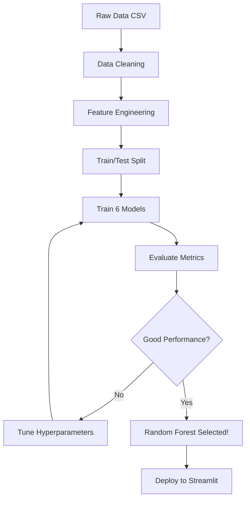

# Machine Learning Theory - Car Price Prediction

## Tài Liệu Học Tập Lý Thuyết Machine Learning

Tài liệu này giải thích chi tiết các khái niệm và thuật toán Machine Learning được sử dụng trong dự án dự đoán giá xe.

---

## Mục Lục

1. [Khái Niệm Cơ Bản](#1-khái-niệm-cơ-bản)
2. [Thuật Toán Linear Regression](#2-linear-regression)
3. [Thuật Toán Ridge Regression](#3-ridge-regression)
4. [Thuật Toán Lasso Regression](#4-lasso-regression)
5. [Thuật Toán SVR](#5-support-vector-regression-svr)
6. [Thuật Toán Random Forest](#6-random-forest)
7. [Thuật Toán Gradient Boosting](#7-gradient-boosting)
8. [Feature Engineering](#8-feature-engineering)
9. [Model Evaluation](#9-đánh-giá-model)
10. [Overfitting & Underfitting](#10-overfitting-và-underfitting)

---

## 1. Khái Niệm Cơ Bản

### 1.1 Machine Learning Là Gì?

**Machine Learning (ML)** là một nhánh của Artificial Intelligence (AI) cho phép máy tính học từ dữ liệu mà không cần được lập trình cụ thể.

**Ví dụ từ project**: Thay vì viết rules cứng như "Nếu xe Toyota Vios 2020 có 50K km thì giá = 420 triệu", model tự học pattern từ 8,685 xe trong dataset.

### 1.2 Supervised Learning

**Supervised Learning** là học có giám sát - model học từ dữ liệu có nhãn (labeled data).

**Công thức tổng quát**:
```
f(X) = y
```
- **X**: Input features (Brand, Model, Year, KM)
- **y**: Target output (Price)
- **f**: Function mà model cần học

**Trong project**:
- Input: `[Year=2020, Age=6, KM_Negative=-50000, Brand_Encoded=45, Model_Encoded=123]`
- Output: `Price = 420 triệu VNĐ`

### 1.3 Regression vs Classification

| Aspect | Regression | Classification |
|--------|-----------|----------------|
| **Output** | Continuous (số thực) | Discrete (category) |
| **Example** | Giá xe = 420.5 triệu | Loại xe = "Sedan" |
| **Use Case** | Dự đoán giá, nhiệt độ | Spam detection, nhận diện ảnh |
| **Project** | ✅ Dùng Regression | ❌ Không dùng |

### 1.4 Train/Test Split

**Tại sao cần split?**
- **Training set**: Dùng để train model (80% = 6,948 xe)
- **Test set**: Dùng để đánh giá model (20% = 1,737 xe)

**Ví dụ**:
```python
from sklearn.model_selection import train_test_split

X_train, X_test, y_train, y_test = train_test_split(
    X, y, test_size=0.2, random_state=42
)
```

**Nguyên tắc vàng**: KHÔNG BAO GIỜ train trên test set! Đó là gian lận.

---

## 2. Linear Regression

### 2.1 Khái Niệm

Linear Regression tìm đường thẳng (hoặc mặt phẳng) tốt nhất fit với data.

**Công thức**:
```
y = β₀ + β₁x₁ + β₂x₂ + ... + βₙxₙ
```

**Trong project (5 features)**:
```
Price = β₀ + β₁×Year + β₂×Age + β₃×KM_Negative + β₄×Brand_Encoded + β₅×Model_Encoded
```

### 2.2 Cách Hoạt Động

**Goal**: Minimize **Mean Squared Error (MSE)**

```
MSE = (1/n) × Σ(yᵢ - ŷᵢ)²
```

**Ví dụ**:
- Actual price: 400 triệu
- Predicted price: 420 triệu
- Error: (400 - 420)² = 400 triệu²
- MSE = Average của tất cả errors

### 2.3 Ưu & Nhược Điểm

**Ưu điểm**:
- ✅ Đơn giản, dễ hiểu
- ✅ Training nhanh
- ✅ Interpretable (có thể giải thích)
- ✅ Ít tham số

**Nhược điểm**:
- ❌ Chỉ xử lý linear relationships
- ❌ Nhạy cảm với outliers
- ❌ Assumptions: linearity, independence, homoscedasticity

**Performance trong project**:
- R² (Test) = 0.1967 (19.67% variance explained)
- MAE = 288 triệu VNĐ
- **Kết luận**: Quá thấp vì car price KHÔNG linear!

### 2.4 Khi Nào Dùng?

- ✅ Data có linear relationship
- ✅ Cần interpretability cao
- ❌ KHÔNG dùng khi data complex như car pricing

---

## 3. Ridge Regression

### 3.1 Khái Niệm

Ridge = Linear Regression + **L2 Regularization**

**Mục đích**: Giảm overfitting bằng cách penalty large coefficients.

### 3.2 Công Thức

**Loss function**:
```
Loss = MSE + α × Σ(βᵢ²)
       ^^^   ^^^^^^^^^
       Original  L2 Penalty
```

- **α (alpha)**: Regularization strength (trong project = 1.0)
- **Σ(βᵢ²)**: Sum of squared coefficients

### 3.3 L2 Regularization Hoạt Động Như Thế Nào?

**Không có regularization**:
```
Price = 100 + 50×Year - 200×Age + ...
                ^^      ^^^
            Coefficients có thể rất lớn
```

**Với L2 regularization**:
```
Price = 100 + 10×Year - 15×Age + ...
                ^^      ^^
            Coefficients bị shrink về 0
```

**Lợi ích**:
- Prevent overfitting
- Coefficients không quá lớn
- Model generalize tốt hơn

### 3.4 Performance

**Trong project**:
- R² (Test) = 0.1967
- MAE = 288 triệu
- **Giống Linear!** Tại sao?

**Giải thích**: 
- Car price data không có overfitting issue với linear models
- Regularization không giúp gì khi model quá simple
- Cần complex model hơn!

---

## 4. Lasso Regression

### 4.1 Khái Niệm

Lasso = Linear Regression + **L1 Regularization**

**Điểm khác Ridge**: L1 có thể set coefficients = 0 (feature selection)

### 4.2 Công Thức

**Loss function**:
```
Loss = MSE + α × Σ|βᵢ|
       ^^^   ^^^^^^^^^
       Original  L1 Penalty
```

### 4.3 L1 vs L2 Regularization

| Aspect | L1 (Lasso) | L2 (Ridge) |
|--------|-----------|-----------|
| **Penalty** | Σ\|βᵢ\| | Σ(βᵢ²) |
| **Coefficients** | Một số = 0 | Shrink về 0 (nhưng không = 0) |
| **Feature Selection** | ✅ Có | ❌ Không |
| **Use Case** | Nhiều features, cần select | Tất cả features đều quan trọng |

**Ví dụ**:
```
Ridge: β = [0.05, 0.03, 0.01, 0.02]  # Tất cả > 0
Lasso: β = [0.8, 0, 0, 0.2]          # Feature 2,3 = 0
```

### 4.4 Performance

**Trong project**:
- R² (Test) = 0.1965
- MAE = 288 triệu
- **Giống Linear & Ridge!**

**Lý do**: 5 features đều quan trọng, không cần feature selection.

---

## 5. Support Vector Regression (SVR)

### 5.1 Khái Niệm

SVR là SVM (Support Vector Machine) cho regression.

**Idea**: Tìm một "tube" xung quanh data points, cho phép errors trong tube nhưng penalty errors ngoài tube.

### 5.2 Kernel Trick

**Problem**: Data không linear

**Solution**: Map data sang higher dimension space bằng kernel function.

**RBF (Radial Basis Function) Kernel**:
```
K(x, x') = exp(-γ × ||x - x'||²)
```

**Ví dụ**:
```
Original space (2D):
  •  •
 •    •    ← Không thể fit linear

Kernel space (higher dimension):
  •      •
     •       ← Có thể fit linear!
  •      •
```

### 5.3 Hyperparameters

**C (Regularization parameter)**:
- C lớn → Fit data chặt chẽ (có thể overfit)
- C nhỏ → Nhiều errors được phép (underfit)
- Trong project: C = 100

**Gamma**:
- Gamma lớn → Chỉ ảnh hưởng gần
- Gamma nhỏ → Ảnh hưởng xa
- Trong project: gamma = 'scale' (auto)

**Epsilon**:
- Size của "tube"
- Trong project: ε = 0.1

### 5.4 Performance

**Trong project**:
- R² (Test) = 0.0518 (5.18%) ⚠️ RẤT THẤP!
- MAE = 291 triệu

**Tại sao SVR fail?**:
1. ❌ **Chưa scale features**: SVR cần StandardScaler
2. ❌ **RBF kernel không phù hợp**: Linear kernel có thể tốt hơn
3. ❌ **Hyperparameters chưa tune**: C, gamma, epsilon chưa optimize

**Cách fix**:
```python
from sklearn.preprocessing import StandardScaler

scaler = StandardScaler()
X_train_scaled = scaler.fit_transform(X_train)
X_test_scaled = scaler.transform(X_test)

svr = SVR(kernel='linear', C=1.0)  # Try linear kernel
svr.fit(X_train_scaled, y_train)
```

---

## 6. Random Forest

### 6.1 Khái Niệm

Random Forest = Ensemble của nhiều Decision Trees

**Idea**: 
- Train nhiều trees trên random subsets của data
- Mỗi tree vote
- Average predictions

### 6.2 Decision Tree

**Cách hoạt động**:
```
                 [Year >= 2015?]
                 /             \
              Yes               No
              /                   \
      [KM < 80000?]         [Brand = Toyota?]
       /        \              /           \
     Yes        No           Yes           No
     /           \           /              \
  420M         380M       250M            180M
```

**Ví dụ với xe**:
- Toyota Vios 2020, 50K km → Follow path → Predict 420M

### 6.3 Random Forest Process

**Step 1: Bootstrap** (Random sampling with replacement)
```
Original data: 8,685 xe
Sample 1: 8,685 xe (randomly sampled)
Sample 2: 8,685 xe (randomly sampled)
...
Sample 100: 8,685 xe (randomly sampled)
```

**Step 2: Random Feature Selection**
- Mỗi split: chỉ xét random subset của features
- Trong project: √5 ≈ 2 features per split

**Step 3: Build Trees**
- Train 100 trees độc lập
- Mỗi tree khác nhau

**Step 4: Aggregate**
```
Tree 1 predicts: 410M
Tree 2 predicts: 430M
Tree 3 predicts: 420M
...
Tree 100 predicts: 415M

Final prediction = Average = 420M
```

### 6.4 Hyperparameters

**n_estimators**: Số trees
- Trong project: 100 trees
- Nhiều trees → Tốt hơn (nhưng slower)

**max_depth**: Độ sâu tối đa của tree
- Trong project: None (unlimited)
- Sâu quá → Overfit

**min_samples_split**: Min samples để split node
- Default: 2
- Lớn hơn → Prevent overfit

**n_jobs**: Parallel processing
- Trong project: -1 (use all CPU cores)

### 6.5 Feature Importance

Random Forest có thể tính **feature importance**:

```
Importance = Reduction in MSE khi split bằng feature đó
```

**Trong project**:
1. Model_Encoded: 44.79%
2. Brand_Encoded: 24.26%
3. Age: 10.84%
4. KM_Negative: 10.46%
5. Year: 9.64%

**Giải thích**: Model xe quan trọng nhất! Brand + Model = 69% importance.

### 6.6 Performance

**Trong project**:
- R² (Train) = 0.9626 (96.26%)
- R² (Test) = **0.8618** (86.18%) ⭐ **BEST!**
- MAE = 87 triệu VNĐ

**Tại sao tốt nhất?**:
- ✅ Xử lý non-linear relationships
- ✅ Không cần feature scaling
- ✅ Robust với outliers
- ✅ Automatic feature interactions

---

## 7. Gradient Boosting

### 7.1 Khái Niệm

Gradient Boosting = Sequential ensemble

**Idea**: Mỗi tree sửa lỗi của tree trước

**Khác Random Forest**:
- Random Forest: Trees độc lập, train parallel
- Gradient Boosting: Trees phụ thuộc, train sequential

### 7.2 Cách Hoạt Động

**Step 1**: Train tree đầu tiên
```
Tree 1 predicts: 400M (actual = 450M)
Error: 50M
```

**Step 2**: Train tree 2 để predict ERROR
```
Tree 2 learns to predict: +50M
Combined: 400M + 50M = 450M ✅
```

**Step 3**: Continue...
```
Tree 3 predicts error của (Tree 1 + Tree 2)
Tree 4 predicts error của (Tree 1 + Tree 2 + Tree 3)
...
```

**Final prediction**:
```
Prediction = Tree1 + Tree2 + Tree3 + ... + Tree100
```

### 7.3 Gradient Descent

**Loss function**:
```
L = Σ(yᵢ - ŷᵢ)²
```

**Gradient**:
```
∂L/∂ŷ = -2(yᵢ - ŷᵢ) = -2 × residual
```

Mỗi tree fit vào **negative gradient** → Minimize loss.

### 7.4 Hyperparameters

**n_estimators**: Số trees
- Trong project: 100
- Nhiều quá → Overfit

**learning_rate**: Learning rate
- Default: 0.1
- Nhỏ → Train chậm nhưng accurate hơn
- Lớn → Train nhanh nhưng có thể miss optimal

**max_depth**: Độ sâu tree
- Thường shallow (3-5) để tránh overfit
- Trong project: 3 (default)

### 7.5 Performance

**Trong project**:
- R² (Train) = 0.7469
- R² (Test) = **0.7372** (73.72%)
- MAE = 149 triệu

**So sánh Random Forest**:
- Random Forest: 86.18% ⭐
- Gradient Boosting: 73.72%

**Tại sao thấp hơn RF?**:
- Gradient Boosting dễ overfit hơn
- Cần tune hyperparameters (learning_rate, max_depth)
- Random Forest robust hơn cho dataset này

---

## 8. Feature Engineering

### 8.1 Khái Niệm

**Feature Engineering** là quá trình tạo features mới từ raw data để improve model performance.

### 8.2 Features Trong Project

#### 8.2.1 Raw Features

**Input từ CSV**:
- Name: "Toyota Vios 2020"
- Price: "450 triệu"
- Year: "2020"
- Kilometers: "38,000 Km"

#### 8.2.2 Extracted Features

**Brand & Model**:
```python
Name = "Toyota Vios 2020"
→ Brand = "Toyota"
→ Model = "Vios"
```

#### 8.2.3 Engineered Features

**1. Age (Tuổi xe)**:
```python
Age = Current_Year - Year
Age = 2026 - 2020 = 6 năm
```

**Lý do**: Age capture depreciation tốt hơn Year

**2. KM_Negative (CRITICAL!)**:
```python
KM_Negative = -Kilometers
KM_Negative = -50000
```

**Tại sao negative?**:
- Problem: Model học `Price ↑ khi KM ↑` (SAI!)
- Solution: Negative transformation
- High KM (200K) → -200000 → Low value → Low price ✅

**Trước fix**:
```
KM: 30K  → Price: 380M
KM: 100K → Price: 450M  ❌ SAI!
```

**Sau fix**:
```
KM_Negative: -30000  → Price: 450M
KM_Negative: -100000 → Price: 380M  ✅ ĐÚNG!
```

#### 8.2.4 Encoded Features

**Label Encoding**:
```python
Brand: Toyota → Brand_Encoded: 45
Model: Vios → Model_Encoded: 123
```

**Tại sao encode?**:
- ML models chỉ xử lý numbers
- Cannot train với strings

**Alternative**: One-Hot Encoding (nhưng sẽ có 288 columns cho Model!)

### 8.3 Final Features (5 total)

```
X = [Year, Age, KM_Negative, Brand_Encoded, Model_Encoded]
```

---

## 9. Đánh Giá Model

### 9.1 Metrics

#### 9.1.1 R² Score (Coefficient of Determination)

**Công thức**:
```
R² = 1 - (SS_res / SS_tot)

SS_res = Σ(yᵢ - ŷᵢ)²     # Residual sum of squares
SS_tot = Σ(yᵢ - ȳ)²      # Total sum of squares
```

**Giải thích**:
- R² = 1.0 → Perfect prediction
- R² = 0.86 → Model explains 86% variance
- R² = 0.0 → Model = average value
- R² < 0 → Worse than average!

**Trong project**:
- Random Forest R² = 0.8618 → Giải thích 86% variance ✅

#### 9.1.2 MAE (Mean Absolute Error)

**Công thức**:
```
MAE = (1/n) × Σ|yᵢ - ŷᵢ|
```

**Ví dụ**:
```
Actual: [400, 500, 600]
Predicted: [420, 480, 620]
Errors: [20, 20, 20]
MAE = (20 + 20 + 20) / 3 = 20 triệu
```

**Ưu điểm**:
- ✅ Easy to interpret (same unit as target)
- ✅ Robust với outliers

**Trong project**:
- Random Forest MAE = 87 triệu VNĐ
- Average price = 715 triệu
- Error = 87/715 = 12.2%

#### 9.1.3 RMSE (Root Mean Squared Error)

**Công thức**:
```
RMSE = √[(1/n) × Σ(yᵢ - ŷᵢ)²]
```

**RMSE vs MAE**:
- RMSE penalize large errors more (vì squared)
- MAE treats tất cả errors equally

**Trong project**:
- MAE = 87 triệu
- RMSE = 160 triệu
- RMSE > MAE → Có một số predictions sai nhiều

### 9.2 Confusion Matrix cho Regression?

**Không có!** Confusion matrix chỉ cho classification.

**Alternative**: Residual plot

```
Residual = Actual - Predicted

Good model: Residuals randomly scattered around 0
Bad model: Residuals có pattern
```

---

## 10. Overfitting và Underfitting

### 10.1 Definitions

**Underfitting**: Model quá simple, không capture patterns
**Overfitting**: Model quá complex, memorize training data

### 10.2 Ví Dụ Trực Quan

```
Data points: •••••••••••

Underfitting (straight line):
    ___________
  •   •  • • • •  •

Overfitting (polynomial degree 10):
  • ___ • ___
     •   • • •
        ___

Good fit:
  • • • •
   ~~~~~~  (smooth curve)
```

### 10.3 Phát Hiện Overfitting

**Dấu hiệu**:
- R² (Train) >> R² (Test)
- MAE (Train) << MAE (Test)

**Trong project**:

| Model | R² (Train) | R² (Test) | Verdict |
|-------|-----------|-----------|---------|
| Random Forest | 0.9626 | 0.8618 | Slight overfit |
| Gradient Boosting | 0.7469 | 0.7372 | Good! |
| Linear | 0.1864 | 0.1967 | Underfit |

**Random Forest**:
- Gap = 96% - 86% = 10%
- Acceptable! Not severe overfitting

### 10.4 Giải Pháp

**Underfitting**:
- ✅ Increase model complexity
- ✅ Add more features
- ✅ Remove regularization

**Overfitting**:
- ✅ Regularization (Ridge, Lasso)
- ✅ Cross-validation
- ✅ More training data
- ✅ Reduce model complexity
- ✅ Feature selection

**Trong project**: Random Forest đã balanced tốt!

---

## 11. Tổng Kết

### 11.1 So Sánh Tất Cả Models

| Model | R² (Test) | MAE | Complexity | Speed | Use Case |
|-------|-----------|-----|------------|-------|----------|
| **Random Forest** | **0.8618** ⭐ | **87M** | High | Medium | Non-linear, robust |
| Gradient Boosting | 0.7372 | 149M | High | Slow | Sequential learning |
| Linear Regression | 0.1967 | 288M | Low | Fast | Linear data |
| Ridge | 0.1967 | 288M | Low | Fast | Linear + regularization |
| Lasso | 0.1965 | 288M | Low | Fast | Linear + feature selection |
| SVR | 0.0518 | 291M | High | Slow | Needs feature scaling |

### 11.2 Bài Học Quan Trọng

1. **Algorithm choice matters**: Random Forest 86% vs Linear 19%!

2. **Feature engineering critical**: KM_Negative fix tăng importance từ 5% → 10%

3. **Domain knowledge essential**: Biết rằng KM cao → Giá thấp

4. **Simple models fail on complex data**: Linear không fit car pricing

5. **Tree-based models win**: Random Forest & Gradient Boosting top 2

6. **Hyperparameter tuning needed**: SVR có thể improve với scaling + tuning

### 11.3 Workflow Recap



### 11.4 Kế Hoạch Học Tiếp

**Beginner** ✅:
- Linear Regression
- Ridge/Lasso
- Basic metrics (R², MAE)

**Intermediate** 📚:
- Decision Trees
- Random Forest
- Feature importance
- Cross-validation

**Advanced** 🚀:
- Gradient Boosting
- SVR with kernel tricks
- Hyperparameter tuning (GridSearchCV)
- Ensemble methods (Stacking, Blending)

---

## 12. Tài Liệu Tham Khảo

### 12.1 Books

1. **"Hands-On Machine Learning"** - Aurélien Géron
   - Chapter 4: Training Linear Models
   - Chapter 6: Decision Trees
   - Chapter 7: Ensemble Learning

2. **"The Elements of Statistical Learning"** - Hastie, Tibshirani, Friedman
   - Advanced math, highly recommended

### 12.2 Online Courses

1. **Coursera - Machine Learning** (Andrew Ng)
   - Linear Regression
   - Regularization

2. **Fast.ai - Practical Deep Learning**
   - Random Forest
   - Feature engineering

### 12.3 Documentation

1. **scikit-learn**: https://scikit-learn.org/
   - Official docs cho tất cả algorithms

2. **Kaggle Learn**: https://www.kaggle.com/learn
   - Interactive tutorials

---

## Phụ Lục A: Công Thức Toán Học

### Linear Regression

**Normal Equation**:
```
β = (XᵀX)⁻¹Xᵀy
```

**Gradient Descent**:
```
β := β - α × ∂L/∂β
```

### Ridge Regression

**Closed form**:
```
β = (XᵀX + αI)⁻¹Xᵀy
```

### Metrics

**R² Score**:
```
R² = 1 - Σ(yᵢ - ŷᵢ)² / Σ(yᵢ - ȳ)²
```

**MSE**:
```
MSE = (1/n) × Σ(yᵢ - ŷᵢ)²
```

**RMSE**:
```
RMSE = √MSE
```

**MAE**:
```
MAE = (1/n) × Σ|yᵢ - ŷᵢ|
```

---

## Phụ Lục B: Code Examples

### Train All Models

```python
from sklearn.linear_model import LinearRegression, Ridge, Lasso
from sklearn.svm import SVR
from sklearn.ensemble import RandomForestRegressor, GradientBoostingRegressor

# Initialize models
models = {
    'Linear': LinearRegression(),
    'Ridge': Ridge(alpha=1.0),
    'Lasso': Lasso(alpha=1.0),
    'SVR': SVR(kernel='rbf', C=100),
    'Random Forest': RandomForestRegressor(n_estimators=100, random_state=42),
    'Gradient Boosting': GradientBoostingRegressor(n_estimators=100, random_state=42)
}

# Train and evaluate
for name, model in models.items():
    model.fit(X_train, y_train)
    y_pred = model.predict(X_test)
    r2 = r2_score(y_test, y_pred)
    mae = mean_absolute_error(y_test, y_pred)
    print(f"{name}: R² = {r2:.4f}, MAE = {mae:.0f}")
```

### Feature Engineering

```python
# Create Age feature
df['Age'] = 2026 - df['Year']

# Create KM_Negative (CRITICAL!)
df['KM_Negative'] = -df['Kilometers']

# Label encoding
from sklearn.preprocessing import LabelEncoder

le_brand = LabelEncoder()
le_model = LabelEncoder()

df['Brand_Encoded'] = le_brand.fit_transform(df['Brand'])
df['Model_Encoded'] = le_model.fit_transform(df['Model'])
```

---

**Hết Tài Liệu Lý Thuyết**

**Chúc bạn học tốt!** 📚🚀
