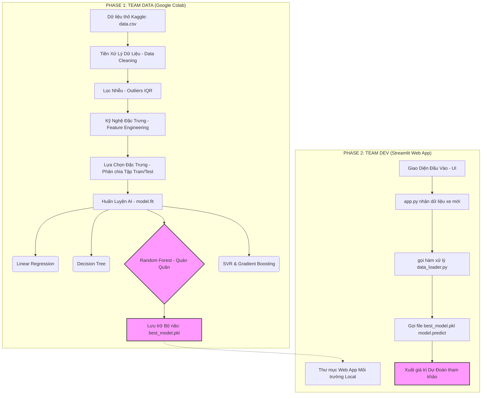

# V-CAR PREDICTOR: KIẾN TRÚC VÀ LUỒNG VẬN HÀNH DỰ ÁN (PROJECT FLOW)

Dưới đây là luồng hoạt động phân tích toàn bộ quy trình phát triển sản phẩm của dự án "Dự đoán giá xe cũ V-Car Predictor". Quy trình được chia thành 2 môi trường tách biệt: **Môi Trường Nghiên Cứu (Jupyter Notebook/Colab)** và **Môi Trường Sản Phẩm (Streamlit Web App)**.

---

## 1. SƠ ĐỒ LUỒNG TỔNG QUAN (MERMAID DIAGRAM)

---

## 2. GIẢI THÍCH CHI TIẾT TỪNG GIAI ĐOẠN

### Giai đoạn 1: Chuẩn bị Vật liệu (Data Collection & Loading)
- **Nguồn:** `data.csv` (15,442 record thu thập từ nền tảng Bonbanh).
- **Vấn đề ban đầu:** 
  - Khác biệt ngôn ngữ (Tiếng Việt xen Tiếng Anh).
  - Giá trị tiền tệ bị ghi chú bằng chữ ("Tỷ", "Triệu").
  - Ký tự phi chữ số, khoảng trắng dư thừa trong tên xe.

### Giai đoạn 2: Trụ cột Tiền xử lí (Data Cleaning)
Trong file mã nguồn, quá trình này thực hiện các bước xử lý ngầm (dùng thư viện Pandas và Regex):
1. Đọc và tải dữ liệu bằng `pd.read_csv()`.
2. Tạo hàm `parse_price()` duyệt biểu thức chính quy (Regex) cắt chuỗi "Triệu" hoặc "Tỷ" biến đổi tất cả về dạng số nguyên thuần túy (Đơn vị triệu VNĐ).
3. Đổi tên toàn bộ Dataframe header sang chuẩn Tiếng Anh.
4. Ép kiểu dữ liệu (Cast type) để tránh Data Types Conflict.

### Giai đoạn 3: Tối ưu dữ liệu (Feature Engineering & Outliers Removal)
Đây là công đoạn quan trọng nhất giúp cho máy tính bớt bị "nhiễu":
- **Lọc Outlier:** Sử dụng kỹ thuật IQR (Interquartile Range). Loại bỏ các mẫu xe bị người bán thổi giá vài chục tỷ (nghi ngờ lỗi gõ nhầm khi thu thập).
- **Tuổi xe (Age):** Lấy `Năm Hiện Tại - Năm Sản Xuất` giúp mô hình dễ hiểu chu kỳ khấu hao của xe hơi.
- **Ký hiệu Âm KM (KM_Negative):** Số đếm ODO (Kilometers) thường đồng biến với sự hao mòn nhưng nghịch biến với Giá. Đổi thành số âm giúp đường chéo biểu đồ tuyến tính sắc nét hơn.
- **Tách tên Model/Brand:** Dùng `.split()` để tách xe "Hyundai Santafe" thành Brand: Hyundai và Model: Santafe.
- **Label Encoding:** Máy không đọc chữ, gán số cho các danh mục (VD: Honda = 1, Hyundai = 2).

### Giai đoạn 4: Đưa vào phòng Tập Train (Model Training & Evaluation)
- Cắt bánh thành 2 miếng: **Tập Train (80%)** và **Tập Test (20%)**.
- Kịch bản đưa dữ liệu vào 6 cỗ máy Machine Learning Regression khác biệt.
- **Cỗ máy Random Forest Regressor** chứng minh uy lực với khả năng tư duy đa luồng (100 Decision Trees), đạt R² score trên 86%. Sai số trung bình khoảng 87 triệu, rất sát so với các yếu tố biến động kinh tế.
- Sau khi được tinh chỉnh xong, máy bắt đầu nắm bí quyết. Lưu bí quyết đó thành `best_model.pkl` sử dụng thư viện `pickle`.

### Giai đoạn 5: Vận hành lên Web App (Deployment)
- Chuyển không gian làm việc từ Jupyter sang File `app.py`.
- Khởi động Framework Web Streamlit. Web đứng ra làm trung gian tiếp khách từ Front-end.
- Front-End đưa tham số cho Back-end (File Streamlit), Backend gọi `best_model.pkl` để dùng hàm `.predict()` bốc thuốc xem kết quả bao nhiêu.
- Hiển thị UI đẹp mắt lên màn hình cho sinh viên và diễn giả.

---

## 3. LỜI KẾT
Quy trình trên vạch rõ biên giới trách nhiệm làm việc nhưng tích hợp chặt chẽ quy luật Data Lifecycle. Không chỉ giải quyết việc gọi Model, quy trình xử lý dữ liệu (Feature Engineering) chính là chìa khóa để "tăng chỉ số IQ" cho mô hình!
